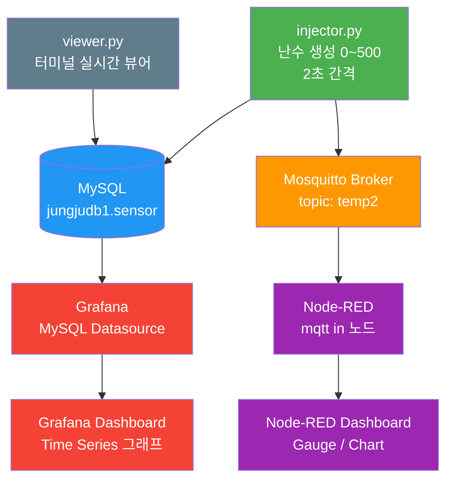

# IoT 센서 데이터 수집 및 모니터링 시스템

## 프로젝트 개요

Python으로 난수(0~500)를 2초마다 생성하여 MySQL DB에 저장하고, MQTT를 통해 Node-RED 및 Grafana로 실시간 모니터링하는 IoT 데이터 파이프라인 시스템.

---

## 기술 스택

| 구분 | 기술 |
|------|------|
| OS | Zorin OS (Ubuntu 기반) |
| 데이터 생성 | Python 3.12 (uv 가상환경) |
| 데이터베이스 | MySQL (LAMP) - jungjudb1 |
| 메시지 브로커 | Mosquitto MQTT |
| 흐름 제어 | Node-RED v4.1.3 |
| 시각화 | Grafana v12.4.2 |

---

## DB 설계

- **Database**: `jungjudb1`
- **Table**: `sensor`

| 컬럼명 | 타입 | 설명 |
|--------|------|------|
| id | INT AUTO_INCREMENT PK | 고유 식별자 |
| random_data | INT | 난수 (0 ~ 500) |
| recorded_at | DATETIME | 저장 시각 |

---

## 파일 구성

| 파일 | 설명 |
|------|------|
| `injector.py` | 난수 생성 → MySQL 저장 + MQTT publish |
| `mqtt-pub.py` | MQTT 단독 publish 테스트용 |
| `viewer.py` | 터미널 실시간 DB 뷰어 |

---

## 동작 설명

1. `injector.py` 실행 시 2초마다 0~500 난수 생성
2. 생성된 값을 MySQL `jungjudb1.sensor` 테이블에 INSERT
3. 동시에 Mosquitto 브로커를 통해 MQTT topic `temp2`로 publish
4. Node-RED가 `temp2` 토픽을 subscribe하여 대시보드에 표시
5. Grafana가 MySQL을 데이터소스로 연결하여 Time series 그래프로 시각화

---

## 시스템 흐름도 (Mermaid)



---

## 실행 방법

```bash
# 데이터 생성 + MySQL 저장 + MQTT publish
uv run injector.py

# 터미널 실시간 뷰어
uv run viewer.py

# MQTT 단독 테스트
uv run mqtt-pub.py
```

---

## GitHub 저장소

- **Repository**: https://github.com/jungju3756-source/capstone_desig_26
- **작업 날짜**: 2026-03-26
