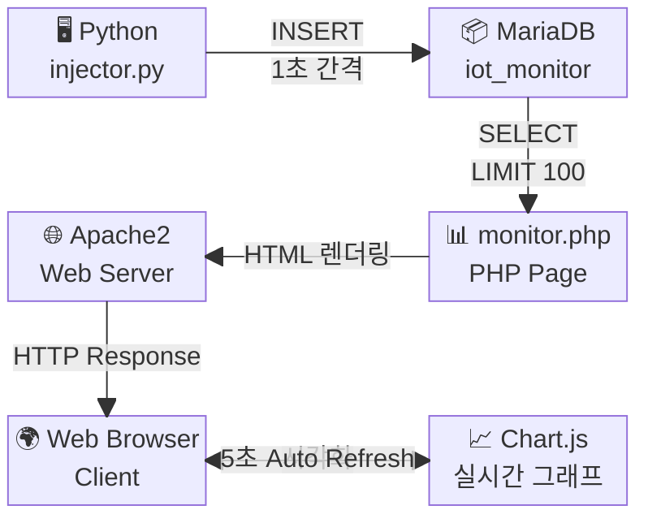
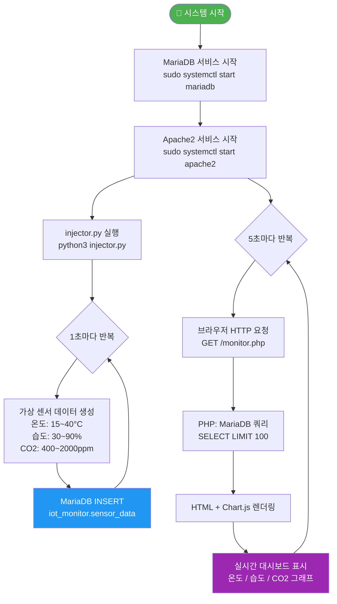
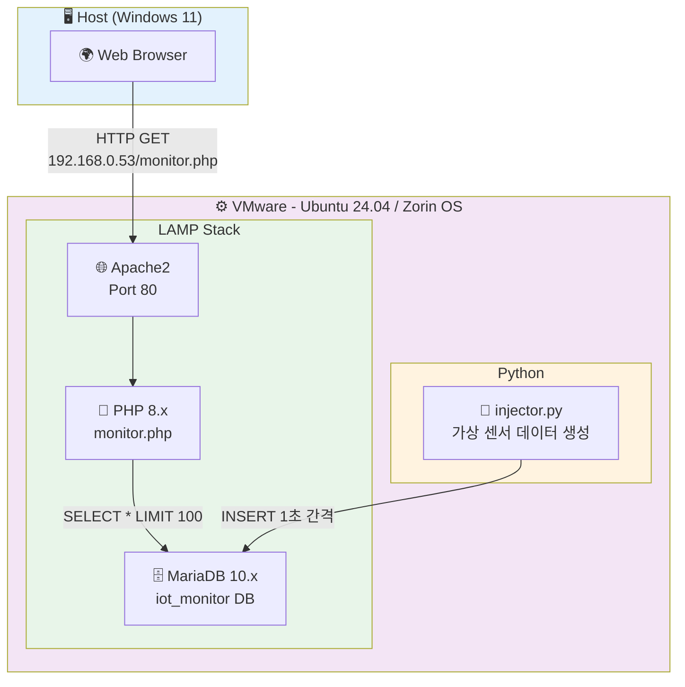
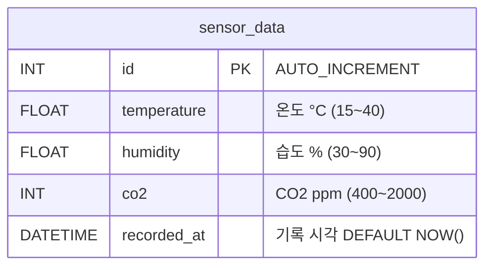
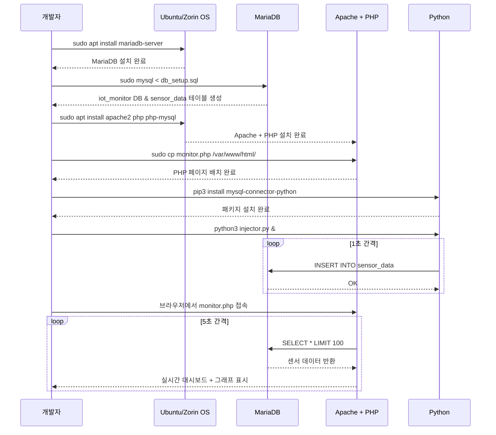
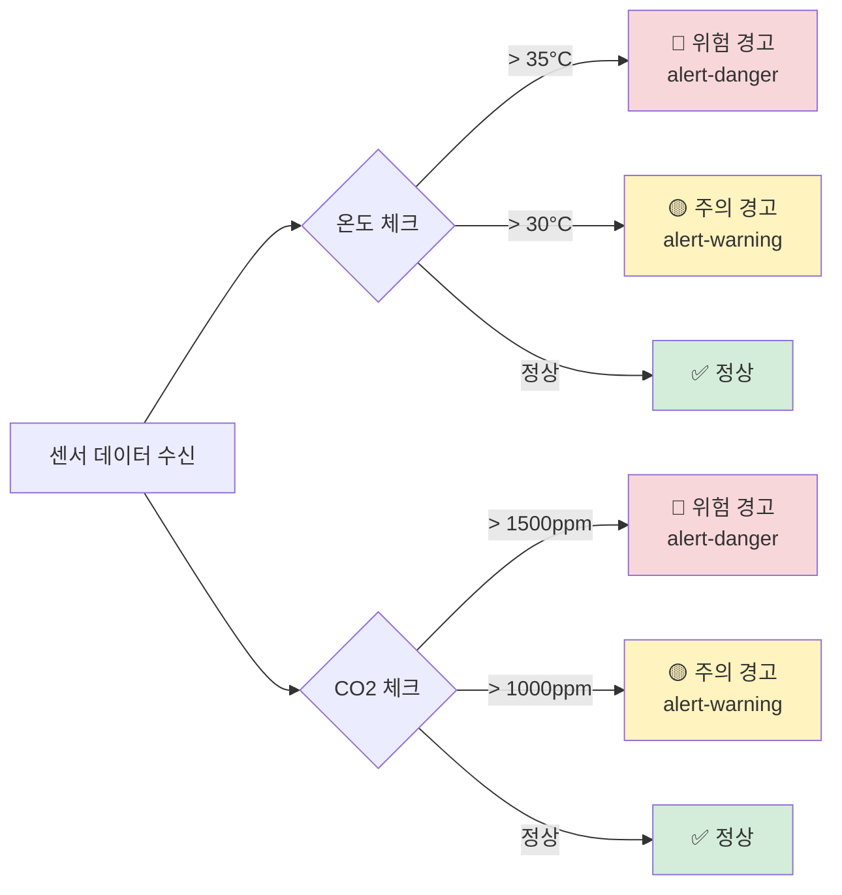

# IoT 환경 모니터링 시스템 구축 과정

---

## 1. 시스템 구성도 (블록 다이어그램)



---

## 2. 데이터 흐름도



---
process.md
## 3. 시스템 아키텍처 계층도



---

## 4. 데이터베이스 구조



---

## 5. 구축 순서



---

## 6. 임계값 경고 로직



---

## 7. 폴더 구조

```
lamp-iot-monitor/
├── project.md          # 프로젝트 계획
├── process.md          # 구축 과정 (본 파일)
├── db_setup.sql        # DB & 테이블 생성 SQL
├── injector.py         # 가상 IoT 데이터 생성 스크립트
├── monitor.php         # 실시간 모니터링 PHP 페이지
└── README.md           # GitHub 소개
```
